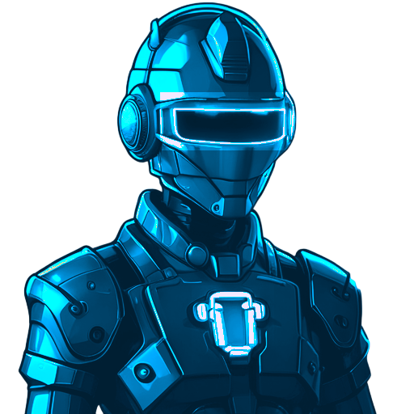
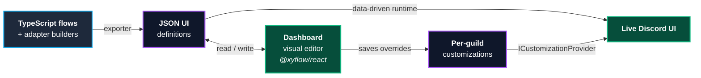

<div align="center">

<a href="https://vertix.gg/">
    
</a>

# Vertix

### A Discord platform — not just a bot.

Advanced temporary voice channels, auto-scaling rooms, and a web dashboard,<br/>
powered by an **open-source framework** for declaring Discord UIs as state machines you can edit visually.

<br/>

[](LICENSE)
[](https://github.com/VertixGG/vertix.gg/stargazers)
[](https://www.typescriptlang.org/)
[](https://bun.sh/)
[](https://discord.js.org/)
[](https://github.com/VertixGG/vertix.gg/pulls)

<br/>

**[🚀 Invite Vertix](https://vertix.gg/invite-vertix)**&nbsp;&nbsp;·&nbsp;&nbsp;**[📖 Documentation](https://vertix.gg/welcome)**&nbsp;&nbsp;·&nbsp;&nbsp;**[🎛️ Dashboard](https://dashboard.vertix.gg)**&nbsp;&nbsp;·&nbsp;&nbsp;**[📜 Changelog](https://vertix.gg/changelog)**

</div>

<br/>

<details>
<summary><strong>📑 Table of Contents</strong></summary>

- [Quick Start](#quick-start--run-vertix-locally) — clone, install, run every service locally
- [Why You Should Build on Vertix](#why-you-should-build-on-vertix-) — the pitch, use cases, comparisons, stack
- [How it's modeled](#how-its-actually-modeled) — flows, adapters, the round-trip
- [Core Concepts](#getting-to-know-the-basics) — Master / Dynamic channels
- [Voice Channel Features](#temporary-voice-channels--v2-features) — V2 + V3
- [Auto-Scaling Channels](#auto-scaling-channels-) — fleets that grow on demand
- [Dashboard](#dashboard-) — visual editor + bot management
- [Project Structure](#project-structure) — the monorepo layout
- [License](#license)

</details>

---

## Quick Start — Run Vertix Locally

This monorepo contains every Vertix service: the Discord bot, the REST API, the web dashboard, the marketing website, the logger, and the MCP server. The steps below get the entire stack running on your machine.

### 1. Prerequisites

Install these once on your system:

| Tool | Version | Notes |
| --- | --- | --- |
| [Bun](https://bun.sh/) | `>= 1.3.0` | Package manager + runtime for every service |
| [Docker](https://www.docker.com/) (or Docker Desktop) | latest | Used to run Redis via `docker-compose` |
| [MongoDB](https://www.mongodb.com/try/download/community) | `>= 6.x` | Must run as a **replica set** (Prisma requirement) |
| Git | latest | To clone the repo |

> [!TIP]
> You can also use a managed **MongoDB Atlas** cluster instead of a local install — just point `BOT_PRISMA_DATABASE_URL` / `API_PRISMA_DATABASE_URL` at it.

You'll also need a [Discord bot token](https://discord.com/developers/applications) and a Discord OAuth2 client (client id + secret + redirect URI) for the dashboard sign-in.

### 2. Clone & Install

```bash
git clone https://github.com/VertixGG/vertix.gg.git
cd vertix.gg

bun install
```

This installs every workspace (`apps/*`, `packages/*`, `assets`) in one shot.

### 3. Configure Environment Variables

Every Vertix service (bot, api, dashboard, mcp, logger) loads from a **single root-level `.env`** file. The repo ships with a fully-commented [example.env](example.env) — copy it to `.env` and fill in your values:

```bash
cp example.env .env
```

Then open `.env` and fill in at minimum the following values (the rest already have safe defaults):

| Variable | Where to get it |
| --- | --- |
| `DISCORD_TEST_TOKEN` | [Discord Developer Portal](https://discord.com/developers/applications) → your app → **Bot** → **Reset Token** |
| `OWNERD_ID` | Your own Discord user id (right-click your profile → **Copy User ID**, with Developer Mode on) |
| `BOT_PRISMA_DATABASE_URL` | Your MongoDB replica set URL (default `mongodb://127.0.0.1:27017/discord?directConnection=true` works for a local install) |
| `API_PRISMA_DATABASE_URL` | Same MongoDB instance, separate database — default `mongodb://127.0.0.1:27017/api?directConnection=true` |
| `DASHBOARD_DISCORD_CLIENT_ID` | Discord Developer Portal → **OAuth2** → **Client ID** |
| `DASHBOARD_DISCORD_CLIENT_SECRET` | Discord Developer Portal → **OAuth2** → **Client Secret** |
| `DASHBOARD_DISCORD_REDIRECT_URI` | Add `http://localhost:3021/api/auth/discord/callback` to the OAuth2 **Redirects** list, then paste it here |
| `DASHBOARD_SESSION_SECRET` | Generate one: `openssl rand -base64 32` |

The `OPENAI_API_KEY`, `TOP_GG_TOKEN`, and `*_DEPLOY_*` blocks are **optional** — leave them empty unless you're using those features.

> [!WARNING]
> **Never commit your `.env` file.** It's already gitignored — only `example.env` is checked in.

> [!TIP]
> When you add a new env variable, also add it to [example.env](example.env) (with a placeholder, not a real value) so contributors know it exists.

### 4. Start Infrastructure

#### MongoDB (replica set)

If you installed MongoDB locally, start it as a replica set:

```bash
# Start mongod with a replica set name
mongod --dbpath /path/to/data --replSet rs0

# In another terminal, initialize the replica set (only the first time)
mongosh < setup-replica-set.js
```

If you're on macOS with Homebrew, an alternative is `brew services start mongodb-community` and then run the `mongosh` step above.

#### Redis (Docker)

```bash
bun run vertix:redis:start    # docker-compose up -d
# Other helpers:
bun run vertix:redis:logs     # follow logs
bun run vertix:redis:cli      # open redis-cli
bun run vertix:redis:stop     # stop the container
```

### 5. Generate Prisma Clients

```bash
cd packages/vertix-prisma
bunx prisma generate --schema prisma/bot.schema.prisma
bunx prisma generate --schema prisma/api.schema.prisma
cd ../..
```

### 6. Start Every Service

Each service runs as its own long-lived process. Open a terminal per service (or use a process manager like [tmux](https://github.com/tmux/tmux), [overmind](https://github.com/DarthSim/overmind), or your IDE's run configurations):

```bash
# 1. Discord bot
bun run vertix:bot:bun:start:dev

# 2. REST API (powers the dashboard)        → http://localhost:3021
bun run vertix:api:dev

# 3. Dashboard (Vite dev server)            → http://localhost:3020
bun run vertix:dashboard:dev

# 4. Marketing website                      → http://localhost:5173 (Vite default)
bun run vertix:website:dev

# 5. Logger service (optional, for log UI)  → http://localhost:3090
bun run vertix:logger:dev

# 6. MCP server (optional, for AI tooling)
bun run vertix:mcp:dev
```

> [!TIP]
> Want the bot to auto-restart on crash during development? Use the included loop script: `bash run-bot-loop.sh`

### 7. Invite Your Bot & Configure It

1. In the [Discord Developer Portal](https://discord.com/developers/applications), invite your bot to a test server with the `bot` and `applications.commands` scopes (and the **Manage Channels**, **Move Members**, **Manage Roles**, **View Channels**, **Send Messages** permissions at minimum).
2. In your test server, run `/setup` and click **➕ Create Master Channel** (or **📈 Create Scaling Channel**) — see the [full setup walkthrough below](#getting-started-1).
3. Open the dashboard at [http://localhost:3020](http://localhost:3020) and sign in with the Discord account that's in your test server. You can now manage master channels, edit translations, and use the visual editor straight from the browser.

### 8. Verify Everything Is Working

```bash
# Type-check the entire monorepo
bun run vertix:typecheck

# Run all Jest test suites (base + bot + gui)
bun run vertix:jest

# Lint
bun run vertix:eslint
```

Once the bot prints `Ready!`, the API is listening on port `3021`, and the dashboard loads at `http://localhost:3020` — you're fully self-hosted.

---

## Why You Should Build on Vertix 🚀

Discord bot UIs get ugly fast. Six months in, you've got a `switch` statement on `customId` 400 lines deep, an i18n bolt-on you wrote on a Friday, embeds living in `.txt` files that *almost* match what's in code, and shipping a UI tweak still means a redeploy. Vertix is built around a different idea: **model your bot as a state machine and the rest falls out** — visual editing, hot customization, type safety, i18n, all of it.

### The pitch in five lines

- **Skip the boilerplate.** No more `if (interaction.customId.startsWith("..."))`. Declare `bindButton(elementId, transition, handler)` and the framework owns the routing, ack/defer, expiry, and disposal.
- **Edit your bot UI without redeploying.** Every flow, embed, button label, and modal is exportable to JSON, editable per guild and per language, and reloaded by the bot at next render.
- **Visual editor for free.** Your code is the source of truth — but the dashboard auto-renders it as an `@xyflow/react` node graph: flows are nodes, transitions are edges, modals are child nodes. PMs, designers, and translators can tweak text without ever opening VS Code.
- **Discord's 100-char `custom_id` limit becomes a non-issue.** Hash-based ids let you nest component trees as deep as you want.
- **i18n is the default, not a v2 problem.** Seven languages ship out of the box (en, ru, el, es, fr, de, ja); add a JSON file for any other.

### Built for bots like these

Concrete scenarios where Vertix earns its keep — each one is hard to do well in raw discord.js but practically free here:

- **Multi-step `/setup` wizards.** Onboarding flows with Back/Next, per-step validation, and modals for input. → [`UIWizardFlowBase`](packages/vertix-gui/src/bases/ui-wizard-flow-base.ts) + [`WizardAdapterBuilder`](packages/vertix-gui/src/builders/wizard-adapter-builder.ts) gives you `nextStep()` / `previousStep()` / step components and the standard control row out of the box. Vertix's own `/setup` is exactly this.
- **Ticket / support systems.** Open → pick category → fill modal → assigned → resolved, with claim/transfer/escalation. → State machines with typed transitions and `getRequiredData(transition)` so you can't advance with missing fields. There's a [`ticket/`](apps/vertix-bot/src/ui/ticket) module already wired up.
- **Per-server admin panels.** Server admins configure your bot from inside Discord *and* from a web dashboard, with both staying in sync. → The same flow JSON powers both surfaces; [`ICustomizationProvider`](packages/vertix-gui/src/customization/customization-provider.ts) keeps per-guild overrides consistent.
- **Voting / claim / approval flows.** Proposal posted → vote period with live tally → automatic resolution. → Flows with timed transitions ([`UIEmbedTimeElapsedBase`](packages/vertix-gui/src/bases/ui-embed-time-elapsed-base.ts)) and multi-user state — the channel-claim feature in Vertix is built on this.
- **Bot-as-a-service / white-label products.** You sell access to one bot; each customer wants different copy, branding, language, and feature toggles. → Per-guild customization + 7 built-in languages mean you don't fork the codebase per customer.
- **Marketplaces, game/RPG bots, character sheets, inventory, combat.** Anything with branching state across many screens. → Cross-flow handoffs (`getEntryPoints` / `getHandoffPoints`) let you split a 50-screen bot into composable, individually-testable flows.
- **Migrating a v1 UI to v2 without breaking existing servers.** → [`UIAdapterVersioningService`](packages/vertix-gui/src/ui-adapter-versioning-service.ts) runs both side-by-side; servers opt in to the new version when they're ready.
- **AI agents that drive Discord UIs.** Let a model open a flow, fill a modal, click a button. → The [MCP server](apps/vertix-mcp) exposes the flow graph as tool calls.
- **PM / translator workflows.** Non-engineers tweak copy, reorder buttons, swap emoji per locale without touching code. → The visual editor reads/writes the same JSON the runtime uses; engineers stay in TS.

### How it compares

| You're using… | Where it hurts | Where Vertix is different |
| --- | --- | --- |
| Raw **discord.js** | You hand-roll every collector, customId, and embed string. Six months in: hairball. | Declarative state machines, typed transitions, generated routing. Same `discord.js` underneath — you keep all the escape hatches. |
| **Sapphire / discord-akairo / discordx** | Great for command routing — but UI is still raw `discord.js` builders and manual interaction handling. | Sits *above* the command layer. You can use Sapphire for slash commands and Vertix for the UI screens those commands open. |
| **Botpress / Voiceflow / generic flow builders** | Built for chatbots, not Discord. No native embeds, modals, slash commands, or button styles. | Discord-native: every node maps to a real Discord component, with full type info and previews that match production pixel-for-pixel. |
| **Custom in-house framework** | You'll spend a quarter on i18n, a sprint on customId hashing, a month on the visual editor — and still won't have it. | Already written, battle-tested in production on Vertix's own bot, MIT-licensed. |

### What it utilizes

The framework is intentionally built on the same boring, popular tools you already know — no exotic runtimes, no proprietary protocols.

- **[TypeScript](https://www.typescriptlang.org/)** end-to-end. State, transition, data, and args are all generic parameters. Renaming a transition lights up every consumer at compile time.
- **[discord.js v14](https://discord.js.org/)** as the transport. Builders ([`ButtonBuilder`](packages/vertix-gui/src/builders/button-builder.ts), [`EmbedBuilder`](packages/vertix-gui/src/builders/embed-builder.ts), [`StringSelectMenuBuilder`](packages/vertix-gui/src/builders/string-select-menu-builder.ts), [`TransactionBuilder`](packages/vertix-gui/src/builders/transaction-builder.ts)) wrap discord.js without hiding it — drop down to `Interaction` whenever you need to.
- **[Bun](https://bun.sh/)** monorepo with workspaces — install everything in one shot, run any service with a single script.
- **[Prisma](https://www.prisma.io/) + MongoDB** for the persistence layer (replica-set required, schema in [`packages/vertix-prisma/prisma`](packages/vertix-prisma/prisma)).
- **[React 18](https://react.dev/) + [@xyflow/react](https://reactflow.dev/) + [Tailwind 4](https://tailwindcss.com/)** for the dashboard's flow editor and the live preview pane.
- **[Fastify v5](https://fastify.dev/)** for the [REST API](apps/vertix-api) that bridges the dashboard to the bot — Discord OAuth2 sessions, guild-scoped customization endpoints, customization provider sync.
- **[Redis](https://redis.io/)** for ephemeral interaction state.
- **[fastmcp](https://github.com/punkpeye/fastmcp)** + **[@modelcontextprotocol/sdk](https://modelcontextprotocol.io/)** so AI agents can drive your UI flows ([`apps/vertix-mcp`](apps/vertix-mcp)).

### How it's actually modeled

**Flows** ([`UIFlowBase<TState, TTransition, TData>`](packages/vertix-gui/src/bases/ui-flow-base.ts)) are typed finite state machines. Each declares:

- `getNextState(transition)` — the transition function.
- `getRequiredData(transition)` — what must be in the flow's data for a transition to be legal.
- `getEntryPoints()` / `getHandoffPoints()` — how this flow connects to other flows.
- `getEdgeSourceMappings()` — explicit `(UI element id → transition → target flow)` triples that the visual editor turns into graph edges.

Wizard flows ([`UIWizardFlowBase`](packages/vertix-gui/src/bases/ui-wizard-flow-base.ts)) inherit Back/Next/Finish/Error transitions and step components — that's how `/setup` is built.

**Adapters** glue flows to live Discord interactions. They're declared with a fluent **builder DSL** ([`ExecutionAdapterBuilder`](packages/vertix-gui/src/builders/execution-adapter-builder.ts), [`WizardAdapterBuilder`](packages/vertix-gui/src/builders/wizard-adapter-builder.ts), [`AdminAdapterBuilder`](packages/vertix-gui/src/builders/admin-adapter-builder.ts)):

```ts
// Real adapter from apps/vertix-bot/src/ui/v3/dynamic-channel/dynamic-channel-adapter.ts
const DynamicChannelAdapter = new DynamicExecutionAdapterBuilder( "VertixBot/UI-V3/DynamicChannelAdapter" )
    .setComponent( DynamicChannelComponent )
    .setArgsDataSource( [ "all" ], DynamicChannelUIData.getName() )
    .defineTransactions( ( tx ) => tx
        .setInitialState( "Default" )
        .addState( "Default", {
            executionStep: "default",
            elementsGroup: "VertixBot/UI-V3/DynamicChannelPrimaryMessageElementsGroup",
            embedsGroup:   "VertixBot/UI-V3/DynamicChannel/EmbedsGroup",
        } )
        .addTransition( "OpenRename", { from: "Default", to: "Default" } )
        .bindButton(
            "VertixBot/UI-V3/DynamicChannelRenameButton", "OpenRename",
            async( _ctx, interaction ) => {
                await uiService.get( "VertixBot/UI-V3/DynamicChannelRenameAdapter" )
                    ?.showModal( "VertixBot/UI-V3/DynamicChannelRenameModal", interaction );
            }
        )
        // …more bindButton / bindModal / bindSelectMenu calls
    )
    .build();
```

`bindButton(elementId, transitionName, handler)` is the whole API: it registers the handler, binds it to the named element, declares the transition, and emits a flow trigger that the runtime + exporter pick up. Same pattern for [`bindModal`](packages/vertix-gui/src/builders/transaction-aware-binder.ts) and `bindSelectMenu`.

### The round-trip



Code is the source of truth. The exporter ([`runtime/ui-definition-exporter.ts`](packages/vertix-gui/src/runtime/ui-definition-exporter.ts)) turns it into JSON. The dashboard renders that JSON as an editable graph. Per-guild edits are stored via [`ICustomizationProvider`](packages/vertix-gui/src/customization/customization-provider.ts), and the bot's [data-driven runtime](packages/vertix-gui/src/runtime) layers them on top of the base flow at render time. **No redeploy. No restart.**

### What you get out of the box

| Capability | Implementation |
| --- | --- |
| **Visual flow editor** — flows as nodes, handoffs as edges, modals/components as child nodes | `@xyflow/react` editor in [`apps/vertix-dashboard/src/features/flow-editor`](apps/vertix-dashboard/src/features/flow-editor/) |
| **Data-driven runtime** — export adapters / components / flows to JSON, load them back as live UIs | [`runtime/data-driven-{adapter,component,flow}-factory.ts`](packages/vertix-gui/src/runtime), [`virtual-flow-generator.ts`](packages/vertix-gui/src/runtime/virtual-flow-generator.ts), [`ui-definition-{exporter,loader,runtime}.ts`](packages/vertix-gui/src/runtime) |
| **Per-guild customization** — guilds override embed text, button labels, modal titles per language | [`ICustomizationProvider`](packages/vertix-gui/src/customization/customization-provider.ts) |
| **Hash-based `custom_id`** — Discord's 100-char limit is a non-issue | [`UIHashService`](packages/vertix-gui/src/ui-hash-service.ts) + [`UICustomIdHashStrategy`](packages/vertix-gui/src/ui-custom-id-strategies/ui-custom-id-hash-strategy.ts) |
| **Versioned UIs** — V2 + V3 of the same adapter run side-by-side | [`UIAdapterVersioningService`](packages/vertix-gui/src/ui-adapter-versioning-service.ts) |
| **i18n** — every label/embed/modal resolves through a guild language file | [`ui-language-definitions.ts`](packages/vertix-gui/src/bases/ui-language-definitions.ts), [language JSON](apps/vertix-bot/assets/languages) (en, ru, el, es, fr, de, ja) |
| **React preview** — render any Discord UI in the browser, pixel-accurate | [`@vertix.gg/discord-ui`](packages/vertix-discord-ui/src) — `<DiscordUIComponentMessage />`, `<DiscordChannelWizard />` |
| **Args providers + interaction middleware** — declarative data hydration and permission/channel-type pre-checks | [`runtime/ui-args-provider-registry.ts`](packages/vertix-gui/src/runtime/ui-args-provider-registry.ts), [`bases/ui-interaction-middleware.ts`](packages/vertix-gui/src/bases/ui-interaction-middleware.ts) |

### When you probably *shouldn't* use Vertix

- You're shipping a one-off slash command and don't have any UI state. Use raw discord.js or Sapphire.
- You're not on TypeScript. The framework leans hard on generics — you'll lose half the value in plain JS.
- You don't want a dashboard. The framework runs without one, but the visual-editor + customization story is the main reason to pick it.

> [!NOTE]
> Want to trace a real example end-to-end? Read [`spec/auto-scalling-spec.md`](spec/auto-scalling-spec.md) — it walks through the auto-scaling feature from service layer through flow + adapter to dashboard nodes.

---

## Getting to Know the Basics

Before diving in, two key concepts make Vertix work:

- **Master Channel** — Think of this as the "generator." When you enter a Master Channel, Vertix automatically creates a private space just for you and moves you there.
- **Dynamic Channel** — Your temporary home. It's created the moment you need it and disappears automatically once the last person leaves, keeping your server clean and organized.

---

## Temporary Voice Channels — V2 Features

The classic button-based interface inside every dynamic channel:

- ✏️ **Rename** — Give your space a unique name.
- ✋ **Limit** — Control how many people can join.
- 🚫 **Privacy** — Switch between Public and Private.
- 🙈 **Visibility** — Hide your channel from the list.
- 👥 **Access** — Manage who's allowed or blocked.
- 🔃 **Reset** — Start fresh with default settings.
- 🔀 **Transfer** — Hand over ownership to a friend.
- 😈 **Claim** — Take over inactive channels automatically.

### Access Controls

- **Grant Access** — Override channel state for a specific user.
- **Remove Access** — Revoke a previously granted user.
- **Block / Unblock** — Block (and kick) a user, or lift the block.
- **Kick User** — Remove a user from the channel.

### Claim Flow

When the channel owner leaves and doesn't return within ~10 minutes, the **Claim** button enables. The first user to click steps in to take ownership within ~1 minute. If multiple users click "Step In," a vote starts and the user with the most votes wins ownership.

---

## Temporary Voice Channels — V3 Features 🚀

V3 brings a more modern, intuitive, and lightning-fast interface to your Discord server.

- **Rename** — Change your channel name.
- **User Limit** — Set maximum members.
- **Clear Chat** — Wipe channel messages.
- **Reset** — Restore default settings.
- **Region** — Pick voice server region.
- **Templates** — Save and load channel presets per guild.
- **Permissions** — Manage user access.
- **Privacy** — Toggle public or private.
- **Edit Primary Message** — Customize title and description.
- **Transfer** — Give ownership to another user.
- **Claim** — Take over inactive channels.

---

## Auto-Scaling Channels 📈

Never worry about running out of voice channel capacity again. Vertix automatically creates and manages voice channels based on demand.

- **Smart Creation** — When users join the master channel, they're moved to an available room (or a new one is created on demand).
- **Custom Prefix** — Configure naming like `Room-{index}` for clean, numbered rooms.
- **Max Members** — Set a per-room cap so groups stay the right size.
- **Min Available Buffer** — Keep at least N empty rooms ready at all times.
- **Auto-Renumbering** — Channels are renumbered every ~5 minutes to keep names consistent.
- **Safe Deletion** — Tear down a scaling setup with a confirmation that cleans up all related channels.

Run `/setup` → `📈 Create Scaling Channel` and you're done. [Learn more →](https://vertix.gg/features/auto-scaling)

---

## Dashboard 🎨

Manage your Vertix setup from a web-based dashboard at **[dashboard.vertix.gg](https://dashboard.vertix.gg)** — no commands needed.

### Visual Editor
- Flow-based editor for customizing bot UI components
- Customize embeds, elements, and modals per guild
- Per-language translations with live preview
- Save and apply changes in real-time

### Bot Management
- Create and configure auto-scaling channel setups
- Create and configure dynamic channel setups
- Edit master channel settings from the browser
- Delete setups with safe confirmation

---

## Flexible Setup at Every Level

Vertix gives you control exactly where you need it.

### Server Level
- 🌐 **Language Select** — English, Russian, Greek, Spanish, French, German, Japanese.
- 🚫 **Bad-Words Filter** — Keep your channel names clean.

### Master Channel Level
- 🏷️ **Naming Templates** — Automate how channels look (`{user}'s Channel`, `Room-{index}`, …).
- 🎚️ **Interface Control** — Enable / disable individual buttons in dynamic channels.
- 🛡️ **Verified Roles** — Define who can manage their space.
- 📝 **Detailed Logs** — Send activity to a custom log channel.
- 💬 **Control Panel Channel** — A dedicated text channel auto-created next to the master channel for managing dynamic channels even when you're not in one.
- 👤 **Role-Based Button Overrides** — Customize button layouts for specific roles within a single Master Channel.

---

## Getting Started

Setting up Vertix is a breeze:

1. Type `/setup` in any channel to begin.
2. Click **➕ Create Master Channel** (or **📈 Create Scaling Channel** for auto-scaling).
3. Choose a name template or keep the default by clicking **▶ Next**.
4. Pick your interface buttons and click **▶ Next**.
5. Set your verified roles and click **✔ Finish**.

> [!TIP]
> You can always tweak these settings later using the same `/setup` command.

---

## Buttons Interface

The buttons interface lives **inside** the dynamic channel. Open the chat box of the dynamic channel to access it. With V3, the same controls are available through a sleek embed-driven panel.

---

## Project Structure

This is a [Bun](https://bun.sh)-managed monorepo:

```
vertix.gg/
├── apps/
│   ├── vertix-api/         REST API
│   ├── vertix-bot/         Discord bot
│   ├── vertix-dashboard/   Web dashboard (dashboard.vertix.gg)
│   ├── vertix-mcp/         MCP server
│   ├── vertix-website/     Marketing site (vertix.gg)
│   └── redis/              Redis dev container
├── packages/
│   ├── vertix-base/        Models, managers, encryption, event bus
│   ├── vertix-definitions/ Shared TypeScript definitions
│   ├── vertix-discord-ui/  React renderer that previews Discord UIs in the browser
│   ├── vertix-gui/         ⭐ Discord UI framework (builders, adapters, i18n, hashing, versioning)
│   ├── vertix-logger/      Centralized logging service
│   ├── vertix-prisma/      Database layer (MongoDB via Prisma)
│   ├── vertix-test-utils/  Testing helpers
│   ├── vertix-ui/          Generic React + Tailwind components
│   └── vertix-utils/       Shared utilities
└── assets/                 Brand and emoji assets
```

### Common Scripts

```bash
# Bot
bun run vertix:bot:bun:start:dev

# Website
bun run vertix:website:dev

# Dashboard
bun run vertix:dashboard:dev

# API
bun run vertix:api:dev

# Type-check everything
bun run vertix:typecheck

# Run all Jest suites
bun run vertix:jest
```

---

## Showcase

See it in action without installing anything:

| | |
| --- | --- |
| 🎬 **Live demos & docs** | [vertix.gg/welcome](https://vertix.gg/welcome) — every dynamic-channel feature rendered as a real interactive Discord component using `@vertix.gg/discord-ui` |
| 🧰 **Auto-scaling walkthrough** | [vertix.gg/features/auto-scaling](https://vertix.gg/features/auto-scaling) — wizard, configuration, and scaling logic explained step-by-step |
| 🎛️ **The dashboard** | [dashboard.vertix.gg](https://dashboard.vertix.gg) — sign in with Discord and edit master channel UIs with the visual flow editor |
| 📜 **Changelog** | [vertix.gg/changelog](https://vertix.gg/changelog) — what shipped recently and what's next |

---

## Roadmap & Community

Most of the best features in **Vertix** started as a spark of an idea from a community member. Your feedback is our roadmap.

- 🐛 **Bug reports & feature requests:** [open an issue](https://github.com/VertixGG/vertix.gg/issues)
- 💬 **Got an idea or want to chat?** Join the [Discord community](https://vertix.gg/invite-vertix)
- 🤝 **Want to contribute?** PRs are welcome — see [Quick Start](#quick-start--run-vertix-locally) to get a local environment running


## License

Vertix is released under the **[MIT License](LICENSE)** — free for personal and commercial use. Fork it, modify it, ship it.

<sub>**Legal:** [Privacy Policy](https://vertix.gg/privacy-policy) · [Terms of Service](https://vertix.gg/terms-of-service)</sub>

<div align="center">
  <sub>Built with ❤️ by <a href="https://github.com/iNewLegend">Leonid Vinikov</a> and <a href="https://github.com/VertixGG/vertix.gg/graphs/contributors">contributors</a>.</sub>
</div>
